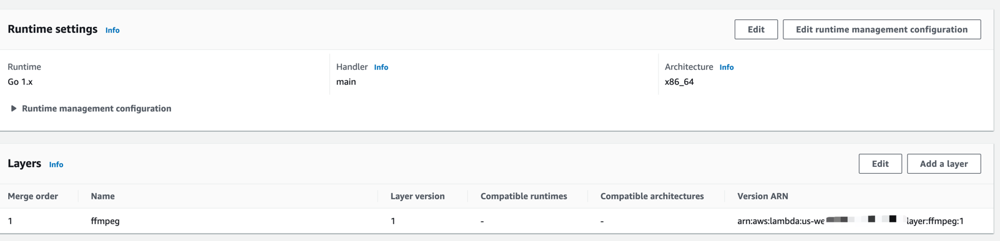

### Description
```
此项目是使用goland语音开发的一个aws lambda 函数，用于处理视频添加logo
This project is an aws lambda function developed by goland voice, which is used to process video and add logo
```
### Lambda config

### Lambda >> configure >> Environment variables
| variables        |              Description               |
| ------------- |:--------------------------------------:|
| AwsAccessKey     |               You aws ak               |
| AwsSecretKey  |               You aws sk               |
|  AwsRegion   | The region where AWS ,like "us-east-1" |
|  Bucket   |         Name of aws s3 bucket          |

### Build
```
GOOS=linux CGO_ENABLED=0 go build main.go 
```

### Zip for lambda
```
zip -r  video-watermark.zip main assets
```
### The test of Event json for lambda
```
{
  "channel": "",
  "name": "@kenxu1234",
  "key": "video/258_1706586088.mp4",
  "file_h":720,
  "file_w":1280,
  "fontsize":15,
  "fontcolor":"#FFFFFF",
  "y_offset":6,
  "x_offset":0
}
```
### Resources
aws: https://docs.aws.amazon.com/zh_cn/lambda/latest/dg/golang-package.html#golang-package-libraries  
ffmpeg: https://github.com/rpidanny/ffmpeg-lambda-layer